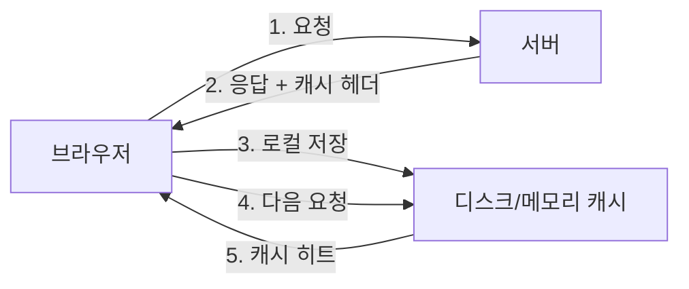
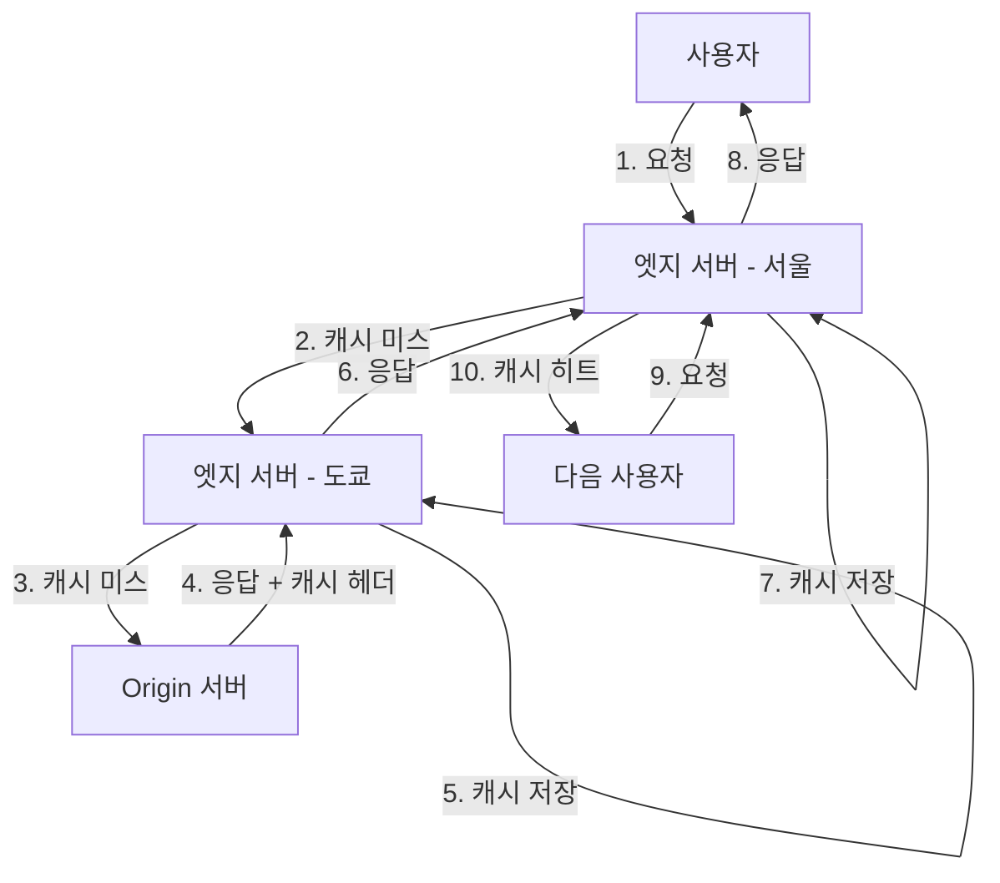
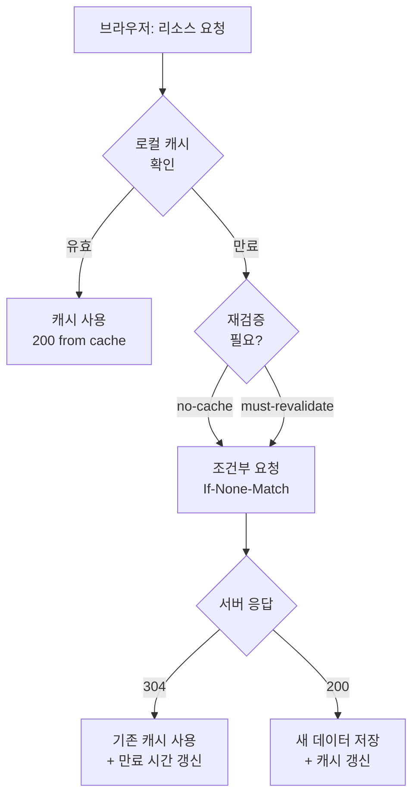
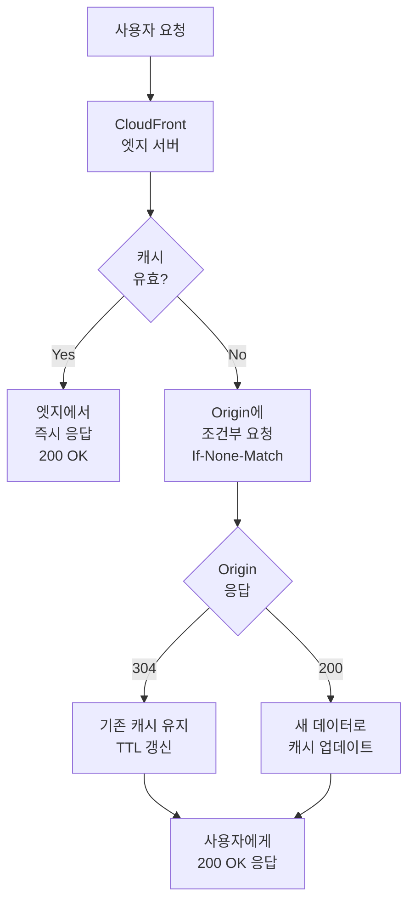
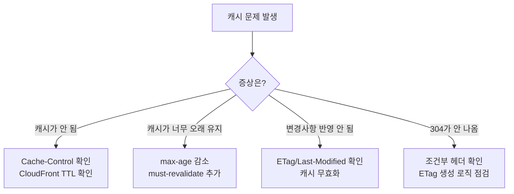

## 들어가며

웹 성능 최적화에서 **캐싱**만큼 효과적인 방법은 드뭅니다. 적절한 캐시 전략은 서버 부하를 줄이고, 네트워크 트래픽을 절감하며, 사용자 경험을 크게 개선합니다.

하지만 HTTP 캐싱은 생각보다 복잡합니다. 브라우저 캐시, CDN 캐시, 조건부 요청, 재검증 등 다양한 개념이 얽혀 있고, 각각의 HTTP 헤더가 어떻게 상호작용하는지 이해해야 제대로 활용할 수 있습니다.

이 글에서는 실전 경험을 바탕으로 **HTTP 캐싱의 모든 것**을 정리합니다.

---

## 캐싱 동작 기본 원리

### 브라우저 캐시

브라우저는 서버에서 내려준 **응답 헤더(Response Header)**를 보고 리소스를 로컬 디스크나 메모리에 저장합니다.



**장점:**
- 네트워크 요청 없이 즉시 리소스 로드
- 서버 부하 감소
- 오프라인 환경에서도 일부 리소스 사용 가능

### CDN 캐시 (CloudFront 등)

CDN은 전 세계 **엣지(Edge) 서버**에 콘텐츠를 캐싱합니다. Origin 서버가 내려주는 헤더 정보를 기반으로 엣지 서버가 캐싱 정책을 결정합니다.



**장점:**
- Origin 서버까지 가지 않고 가까운 엣지에서 응답
- 대규모 트래픽 처리 가능
- DDoS 공격 완화

---

## 캐싱 관련 HTTP 헤더 완벽 정리

### 1. Cache-Control (핵심 헤더)

**가장 중요한 캐싱 제어 헤더**로, 브라우저와 CDN의 캐싱 동작을 지시합니다.

#### 기본 문법

```http
Cache-Control: public, max-age=3600
```

#### 주요 디렉티브

| 디렉티브 | 설명 | 사용 예시 |
|---------|------|----------|
| `public` | 모든 캐시(브라우저, CDN, 프록시)에서 캐싱 가능 | 정적 자산 |
| `private` | 브라우저만 캐싱 가능 (CDN은 캐싱 불가) | 사용자별 데이터 |
| `no-cache` | 캐싱은 하되, 매번 재검증 필요 | 자주 변경되는 리소스 |
| `no-store` | 절대 캐싱하지 않음 | 민감한 정보 |
| `max-age=<seconds>` | 캐시 유효 시간 (초 단위) | `max-age=3600` → 1시간 |
| `s-maxage=<seconds>` | 공유 캐시(CDN) 전용 유효 시간 | `s-maxage=7200` → 2시간 |
| `must-revalidate` | 만료 후 반드시 Origin에 재검증 | 중요한 데이터 |
| `immutable` | 리소스가 절대 변하지 않음 | 버전이 포함된 파일 |
| `stale-while-revalidate=<seconds>` | 만료 후에도 백그라운드 재검증하며 제공 | 빠른 응답 우선 |
| `stale-if-error=<seconds>` | Origin 오류 시 만료된 캐시 사용 | 가용성 우선 |

#### 실전 예제

**정적 자산 (버전 관리)**
```http
# app.abc123.js 같은 해시 포함 파일
Cache-Control: public, max-age=31536000, immutable
```
- 1년간 캐싱, 절대 변하지 않으므로 재검증 불필요
- 파일명에 해시가 포함되어 있어 안전

**API 응답 (신선도와 성능 균형)**
```http
Cache-Control: public, max-age=60, stale-while-revalidate=86400
```
- 1분간 신선, 만료 후 24시간 동안은 백그라운드에서 재검증하며 stale 버전 제공
- 사용자는 즉시 응답 받고, 백그라운드에서 새 데이터 가져옴

**사용자별 데이터**
```http
Cache-Control: private, max-age=300, must-revalidate
```
- 브라우저만 5분간 캐싱, CDN은 캐싱 불가
- 만료 후 반드시 재검증

**민감한 정보**
```http
Cache-Control: no-store, no-cache, must-revalidate, private
```
- 절대 캐싱하지 않음, 매번 서버에서 새로 가져옴

#### CloudFront와 Cache-Control

CloudFront는 다음 우선순위로 캐시 시간을 결정합니다:

1. **`s-maxage`** (있는 경우)
2. **`max-age`** (s-maxage가 없는 경우)
3. **CloudFront TTL 설정** (Minimum/Default/Maximum TTL)

**중요:** CloudFront의 Minimum TTL이 0보다 크면, `no-cache`, `no-store` 디렉티브를 무시하고 강제로 캐싱합니다.

```http
# Origin 서버 응답
Cache-Control: public, s-maxage=7200, max-age=3600

# 결과:
# - CloudFront: 2시간 캐싱
# - 브라우저: 1시간 캐싱
```

---

### 2. Expires (레거시 헤더)

```http
Expires: Wed, 21 Oct 2025 07:28:00 GMT
```

**특징:**
- HTTP/1.0 시절부터 사용된 헤더
- 리소스 만료 시점을 **절대 시각**으로 표현
- `Cache-Control: max-age`와 함께 있으면 **Cache-Control이 우선**

**현재 권장사항:**
- `Cache-Control: max-age` 사용 권장
- `Expires`는 하위 호환용으로만 유지

```http
# 권장하지 않음
Expires: Wed, 21 Oct 2025 07:28:00 GMT

# 권장
Cache-Control: public, max-age=31536000
```

---

### 3. ETag (Entity Tag)

```http
ETag: "686897696a7c876b7e"
```

**동작 원리:**

1. 서버가 리소스의 **고유 식별자**(해시)를 ETag로 제공
2. 브라우저/CDN이 `If-None-Match` 헤더로 ETag 재검증
3. 서버가 변경 여부 판단
   - 변경 없음 → `304 Not Modified` (본문 없음)
   - 변경됨 → `200 OK` + 새 데이터

#### 요청/응답 흐름

```http
# 첫 번째 요청
GET /app.js HTTP/1.1
Host: example.com

HTTP/1.1 200 OK
ETag: "686897696a7c876b7e"
Cache-Control: public, max-age=3600
Content-Length: 12345

[파일 내용]
```

```http
# 캐시 만료 후 재검증
GET /app.js HTTP/1.1
Host: example.com
If-None-Match: "686897696a7c876b7e"

# 변경되지 않았을 때
HTTP/1.1 304 Not Modified
ETag: "686897696a7c876b7e"
Cache-Control: public, max-age=3600

# 본문 없음, 브라우저는 기존 캐시 사용
```

```http
# 변경되었을 때
HTTP/1.1 200 OK
ETag: "abc123def456"
Cache-Control: public, max-age=3600
Content-Length: 13000

[새로운 파일 내용]
```

#### CloudFront와 ETag

CloudFront는 ETag 기반 조건부 요청을 완벽하게 지원합니다:

1. 엣지 서버 캐시 만료 시 Origin에 `If-None-Match` 전송
2. Origin이 `304` 응답 → 엣지 서버는 기존 캐시 유지
3. Origin이 `200` 응답 → 엣지 서버는 새 데이터로 캐시 업데이트

---

### 4. Last-Modified / If-Modified-Since

```http
Last-Modified: Wed, 21 Oct 2023 07:28:00 GMT
```

**동작 원리:**
- ETag와 유사하지만 **시간 기반** 검증
- 브라우저가 `If-Modified-Since` 헤더로 재검증

#### 요청/응답 흐름

```http
# 첫 번째 요청
GET /image.jpg HTTP/1.1
Host: example.com

HTTP/1.1 200 OK
Last-Modified: Wed, 21 Oct 2023 07:28:00 GMT
Cache-Control: public, max-age=86400
Content-Length: 54321

[이미지 데이터]
```

```http
# 캐시 만료 후 재검증
GET /image.jpg HTTP/1.1
Host: example.com
If-Modified-Since: Wed, 21 Oct 2023 07:28:00 GMT

# 변경되지 않았을 때
HTTP/1.1 304 Not Modified
Last-Modified: Wed, 21 Oct 2023 07:28:00 GMT
```

#### ETag vs Last-Modified 비교

| 항목 | ETag | Last-Modified |
|------|------|---------------|
| **정확도** | 매우 높음 (해시 기반) | 낮음 (초 단위) |
| **서버 부하** | 높음 (해시 생성) | 낮음 (파일 시간만) |
| **CDN 호환성** | 일부 CDN에서 문제 가능 | 광범위하게 지원 |
| **우선순위** | ETag가 우선 | ETag 없을 때 사용 |
| **사용 케이스** | 동적 콘텐츠, API 응답 | 정적 파일, 이미지 |

**권장사항:**
- 정적 파일: `Last-Modified` (서버 부하 적음)
- 동적 콘텐츠: `ETag` (정확한 변경 감지)
- 최고 정확도 필요: 둘 다 사용 (ETag 우선)

---

### 5. Vary

```http
Vary: Accept-Encoding, User-Agent
```

**목적:**
- 어떤 **요청 헤더**에 따라 캐시를 별도로 유지할지 결정
- 캐시 키(Cache Key) 분기

#### 실전 예제

**압축 포맷별 캐싱**
```http
Vary: Accept-Encoding
```
- `Accept-Encoding: gzip` → gzip 버전 캐싱
- `Accept-Encoding: br` → Brotli 버전 캐싱
- `Accept-Encoding: identity` → 압축 없는 버전 캐싱

**디바이스별 캐싱**
```http
Vary: User-Agent
```
- 모바일 사용자: 모바일 최적화 페이지
- 데스크톱 사용자: 데스크톱 페이지

**다국어 지원**
```http
Vary: Accept-Language
```
- `Accept-Language: ko-KR` → 한국어 버전
- `Accept-Language: en-US` → 영어 버전

#### CloudFront 주의사항

CloudFront에서 `Vary` 헤더를 과도하게 사용하면 **캐시 효율이 급격히 떨어집니다**.

```http
# 비효율적인 예시
Vary: User-Agent, Accept-Language, Accept-Encoding, Referer

# User-Agent만 수천 가지 조합 가능 → 캐시 히트율 급감
```

**CloudFront 모범 사례:**
1. 필요한 최소한의 헤더만 `Vary`에 포함
2. CloudFront Behavior에서 특정 헤더만 화이트리스트로 포함
3. Lambda@Edge로 헤더 정규화

---

### 6. Age

```http
Age: 1234
```

**의미:**
- 프록시/CDN이 응답을 캐시한 후 **경과 시간** (초 단위)
- CloudFront나 브라우저가 자동으로 추가

#### 캐시 만료 계산

```http
HTTP/1.1 200 OK
Cache-Control: public, max-age=3600
Age: 1200

# 남은 캐시 시간 = max-age - Age = 3600 - 1200 = 2400초 (40분)
```

---

## CloudFront 특화 설정

### Minimum / Default / Maximum TTL

CloudFront 배포 설정에서 TTL을 **강제로 오버라이드**할 수 있습니다.

#### 동작 방식

| Origin 헤더 | CloudFront 설정 | 실제 캐시 시간 |
|-------------|----------------|---------------|
| `max-age=0` | Default TTL=300 | 300초 (5분) |
| `max-age=7200` | Maximum TTL=3600 | 3600초 (1시간) |
| `max-age=600` | Minimum TTL=1800 | 1800초 (30분) |
| 헤더 없음 | Default TTL=86400 | 86400초 (1일) |

**주의사항:**
```
Minimum TTL > 0 이면, no-cache, no-store 무시하고 강제 캐싱!
```

#### 설정 예시

**AWS Console:**
```
CloudFront Distribution → Behaviors → Edit
- Minimum TTL: 0
- Default TTL: 86400 (1일)
- Maximum TTL: 31536000 (1년)
```

**Terraform:**
```hcl
default_cache_behavior {
  min_ttl     = 0
  default_ttl = 86400
  max_ttl     = 31536000
}
```

---

### Lambda@Edge / CloudFront Functions

요청/응답 헤더를 **동적으로 제어**할 수 있습니다.

#### 사용 예시

**모바일 감지 후 캐시 키 분리**
```javascript
// CloudFront Functions (Viewer Request)
function handler(event) {
    var request = event.request;
    var headers = request.headers;
    var userAgent = headers['user-agent'] ? headers['user-agent'].value : '';

    // 모바일 디바이스 감지
    var isMobile = /Mobile|Android|iPhone/i.test(userAgent);

    // 커스텀 헤더 추가 (캐시 키로 사용)
    headers['x-device-type'] = {
        value: isMobile ? 'mobile' : 'desktop'
    };

    return request;
}
```

**응답 헤더 강제 설정**
```javascript
// Lambda@Edge (Origin Response)
exports.handler = async (event) => {
    const response = event.Records[0].cf.response;
    const headers = response.headers;

    // 정적 자산에 강력한 캐싱 적용
    if (event.Records[0].cf.request.uri.match(/\.(js|css|jpg|png|webp)$/)) {
        headers['cache-control'] = [{
            key: 'Cache-Control',
            value: 'public, max-age=31536000, immutable'
        }];
    }

    return response;
};
```

---

## 304 Not Modified 완벽 가이드

### 기본 개념

`304 Not Modified`는 클라이언트가 이미 가진 캐시가 **최신 상태**임을 알려주는 상태 코드입니다.

**핵심 특징:**
- 본문(payload) 없음 → 네트워크 트래픽 절감
- 헤더만 전송 → 응답 속도 향상
- 캐시 만료 시간 갱신 가능

### 304를 발생시키는 조건

#### 1. ETag 기반 재검증

```http
# 클라이언트 요청
GET /api/users HTTP/1.1
Host: api.example.com
If-None-Match: "686897696a7c876b7e"

# 서버 응답 (변경 없음)
HTTP/1.1 304 Not Modified
ETag: "686897696a7c876b7e"
Cache-Control: public, max-age=300
```

#### 2. Last-Modified 기반 재검증

```http
# 클라이언트 요청
GET /images/logo.png HTTP/1.1
Host: cdn.example.com
If-Modified-Since: Wed, 21 Oct 2023 07:28:00 GMT

# 서버 응답 (변경 없음)
HTTP/1.1 304 Not Modified
Last-Modified: Wed, 21 Oct 2023 07:28:00 GMT
Cache-Control: public, max-age=86400
```

### 브라우저 관점의 304 처리



**개발자 도구 확인:**

| Status | Size | Time | 설명 |
|--------|------|------|------|
| `200 (from cache)` | 0 B | 0 ms | 로컬 캐시 히트, 네트워크 요청 없음 |
| `304 Not Modified` | 200 B | 50 ms | 재검증 성공, 헤더만 전송 |
| `200 OK` | 15.3 KB | 120 ms | 새 데이터 다운로드 |

### CDN(CloudFront) 관점의 304 처리



**중요한 점:**
- CloudFront가 Origin에서 `304`를 받아도
- 사용자에게는 `200 OK`로 응답할 수 있음
- 엣지 서버 캐시를 그대로 사용하기 때문

### 304 활용 시 주의사항

#### 1. ETag 충돌 관리

```javascript
// 좋은 예: 파일 해시 기반 ETag
const crypto = require('crypto');
const hash = crypto.createHash('md5').update(fileContent).digest('hex');
const etag = `"${hash}"`;

// 나쁜 예: 타임스탬프 기반 (서버마다 다를 수 있음)
const etag = `"${Date.now()}"`;
```

**로드 밸런서 환경 주의:**
- 여러 서버가 동일한 파일에 대해 **다른 ETag** 생성 가능
- 해결: 파일 내용 기반 해시 사용

#### 2. Last-Modified 정밀도 한계

```bash
# 1초 안에 여러 번 수정 → 동일한 타임스탬프
touch file.txt
# Last-Modified: Wed, 21 Oct 2023 07:28:00 GMT

sleep 0.5
echo "modified" >> file.txt
# Last-Modified: Wed, 21 Oct 2023 07:28:00 GMT (동일!)
```

**해결:**
- 정밀한 변경 감지가 필요하면 **ETag 사용**

#### 3. 무분별한 재검증

```http
# 비효율적인 설정
Cache-Control: no-cache

# 매 요청마다 서버에 재검증 → 304 응답
# 완전한 캐시 히트가 아니므로 여전히 네트워크 비용 발생
```

**해결:**
```http
# 효율적인 설정
Cache-Control: public, max-age=3600, stale-while-revalidate=86400

# 1시간은 재검증 없이 사용
# 만료 후 24시간은 백그라운드 재검증하며 stale 버전 제공
```

---

## 실전 캐싱 전략

### 정적 자산 (버전 관리)

```http
# app.abc123.js, style.def456.css
Cache-Control: public, max-age=31536000, immutable

# 장점:
# - 1년간 재검증 없이 캐싱
# - 파일명 변경 시 자동으로 새 버전 다운로드
# - 브라우저 새로고침해도 재검증 안 함 (immutable)
```

### HTML 페이지

```http
# index.html
Cache-Control: public, max-age=0, must-revalidate

# 장점:
# - 항상 최신 버전 확인
# - 하지만 304 응답으로 빠른 검증 가능
```

### API 응답 (자주 변경)

```http
# GET /api/products
Cache-Control: public, max-age=60, stale-while-revalidate=600

# 장점:
# - 1분간 신선한 데이터
# - 만료 후 10분간은 백그라운드 갱신하며 즉시 응답
```

### API 응답 (거의 변경 안 됨)

```http
# GET /api/categories
Cache-Control: public, max-age=3600, stale-if-error=86400
ETag: "abc123"

# 장점:
# - 1시간 캐싱
# - Origin 장애 시 24시간 동안 만료된 캐시라도 사용
# - ETag로 변경 감지
```

### 사용자별 데이터

```http
# GET /api/user/profile
Cache-Control: private, max-age=300, must-revalidate

# 장점:
# - CDN은 캐싱 안 함 (private)
# - 브라우저에서만 5분간 캐싱
# - 만료 시 반드시 재검증
```

### 민감한 정보

```http
# GET /api/payment/card-info
Cache-Control: no-store, no-cache, must-revalidate, private
Pragma: no-cache

# 장점:
# - 절대 캐싱 안 함
# - 매번 서버에서 최신 데이터
```

---

## CloudFront 캐싱 최적화 전략

### 1. Origin 헤더 + CloudFront TTL 조합

```http
# Origin 서버 응답
Cache-Control: public, s-maxage=86400, max-age=3600

# CloudFront 설정
Minimum TTL: 0
Default TTL: 3600
Maximum TTL: 604800

# 결과:
# - CloudFront: s-maxage=86400 (1일) 사용
# - 브라우저: max-age=3600 (1시간) 사용
```

### 2. 캐시 키 최적화

**기본 캐시 키:**
```
URL + Query String
```

**개선된 캐시 키 (Cache Policy):**
```
URL + Selected Query Strings + Selected Headers + Cookies
```

**예시:**
```javascript
// 캐시 키에 포함할 쿼리 스트링
include: ['version', 'locale']
ignore: ['utm_source', 'fbclid']  // 마케팅 파라미터 무시

// 캐시 키에 포함할 헤더
include: ['Accept-Encoding', 'CloudFront-Is-Mobile-Viewer']
```

### 3. Cache Behavior별 전략

| Path Pattern | TTL | 캐시 키 | 설명 |
|-------------|-----|---------|------|
| `/static/*` | Max | URL만 | 정적 자산 |
| `/api/*` | Default 60초 | URL + Query | API 응답 |
| `/user/*` | Min 0초 | URL + Cookie | 사용자별 |
| `*.html` | Min 0초 | URL + Accept-Encoding | HTML 페이지 |

### 4. Lambda@Edge 활용

```javascript
// Origin Response: 동적 헤더 제어
exports.handler = async (event) => {
    const response = event.Records[0].cf.response;
    const request = event.Records[0].cf.request;

    // URI별 캐시 전략
    if (request.uri.startsWith('/api/')) {
        response.headers['cache-control'] = [{
            key: 'Cache-Control',
            value: 'public, max-age=60, stale-while-revalidate=600'
        }];
    } else if (request.uri.match(/\.(js|css|jpg|png|webp)$/)) {
        response.headers['cache-control'] = [{
            key: 'Cache-Control',
            value: 'public, max-age=31536000, immutable'
        }];
    }

    return response;
};
```

---

## 성능 측정 및 모니터링

### CloudWatch Metrics

**주요 지표:**
```
CacheHitRate: 캐시 히트율 (높을수록 좋음, 목표: 85%+)
OriginLatency: Origin 응답 시간
BytesDownloaded: 다운로드된 바이트 수
Requests: 총 요청 수
4xxErrorRate: 4xx 에러율
5xxErrorRate: 5xx 에러율
```

### 브라우저 성능 측정

```javascript
// Performance API로 캐시 효율 측정
performance.getEntriesByType('resource').forEach(resource => {
    console.log({
        name: resource.name,
        duration: resource.duration,
        transferSize: resource.transferSize,  // 0이면 캐시 히트
        cached: resource.transferSize === 0
    });
});
```

### Chrome DevTools

**Network 패널 분석:**
```
Status: 200 (from disk cache)  → 완벽한 캐시 히트
Status: 304 Not Modified       → 재검증 성공
Status: 200 OK                 → 새 다운로드
```

---

## 결론 및 핵심 요약

### 핵심 원칙

1. **🎯 정적 자산은 장기 캐싱**
   ```http
   Cache-Control: public, max-age=31536000, immutable
   ```
   - 파일명에 해시 포함 (버전 관리)
   - 1년 캐싱, 재검증 불필요

2. **🎯 동적 콘텐츠는 적절한 재검증**
   ```http
   Cache-Control: public, max-age=60, stale-while-revalidate=600
   ETag: "abc123"
   ```
   - 짧은 캐시 + 백그라운드 재검증
   - ETag로 정확한 변경 감지

3. **🎯 HTML은 항상 최신 유지**
   ```http
   Cache-Control: public, max-age=0, must-revalidate
   ```
   - 304 응답으로 빠른 검증

4. **🎯 민감한 데이터는 캐싱 금지**
   ```http
   Cache-Control: no-store, private
   ```

### CDN 최적화 체크리스트

- [ ] Origin에서 적절한 `Cache-Control` 헤더 설정
- [ ] `s-maxage`로 CDN과 브라우저 캐시 분리
- [ ] CloudFront TTL 설정으로 세밀한 제어
- [ ] 캐시 키 최적화 (불필요한 쿼리 스트링 제거)
- [ ] ETag 또는 Last-Modified 설정
- [ ] Cache Behavior별 전략 수립
- [ ] CloudWatch로 캐시 히트율 모니터링 (목표: 85%+)

### 문제 해결 플로우



### 마무리

HTTP 캐싱은 **웹 성능 최적화의 핵심**입니다. 적절한 캐시 전략으로:
- ⚡ 페이지 로딩 속도 50% 이상 개선
- 💰 서버 비용 30-70% 절감
- 📊 대역폭 사용량 대폭 감소

이 글에서 다룬 내용을 바탕으로 프로젝트에 맞는 최적의 캐싱 전략을 수립하시길 바랍니다!
