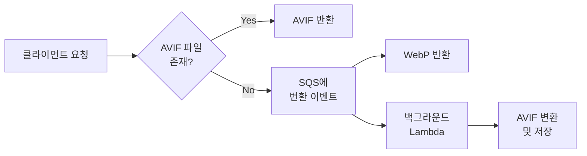

## 배경

최근 진행하고 있는 프로젝트에서 **웹 페이지의 로딩 속도가 SEO 순위에 미치는 영향**이 커지면서, 이미지 최적화가 필요했습니다.

### 선택한 아키텍처

**Lambda@Edge**와 **CloudFront**를 활용하여 다음과 같이 구현하기로 했습니다:

- S3에 저장된 원본 이미지를 실시간으로 리사이징
- 클라이언트의 `Accept` 헤더를 참고하여 최적의 포맷 전달
  - AVIF (최고 압축률)
  - WebP (널리 지원)
  - 원본 포맷 (fallback)

이 글에서는 기존 코드를 바탕으로 개선 사항과 그 과정에서 발생한 문제, 그리고 해결 과정을 소개합니다.

---

## 1. 기존 코드 분석 및 개선 필요성

### 초기 구현

기존 코드는 다음과 같은 흐름으로 동작했습니다:

1. **S3에서 이미지 로드**: `getFileAsBuffer` 함수로 스트림을 Buffer로 변환
2. **이미지 리사이징**: sharp 라이브러리로 크기 조정
3. **WebP 변환**: 변환 후 Base64 인코딩하여 반환
4. **크기 제한**: 가로 사이즈가 856px 초과 시 자동 축소

```typescript
const convertToWebPAndBase64 = async (
  buff: Buffer,
  w?: number,
  h?: number,
  quality: number = 70
): Promise<string> => {
  if (quality <= 10) throw new Error("quality is too low");

  try {
    let result = sharp(buff);
    const metadata = await result.metadata();
    const originalWidth = metadata.width || 0;

    if (w && h) {
      result = result.resize(w, h, { withoutEnlargement: true });
    } else if (originalWidth > 856) {
      result = result.resize({ width: 856 });
    }

    const webpBuffer = await result.webp({ quality }).toBuffer();

    if (webpBuffer.byteLength > MB) {
      return await convertToWebPAndBase64(buff, w, h, Math.floor(quality / 2));
    }

    return webpBuffer.toString("base64");
  } catch (error) {
    throw error;
  }
};
```

### 문제점

기존 코드에서는 이미지의 가로 사이즈가 856px 초과 시 단순히 856px로 줄여주도록 되어 있었습니다. 하지만 **이미지 비율이 고려되지 않아** 왜곡될 가능성이 있었습니다.

### 개선 방안

Sharp의 `resize` 옵션 중 **`fit: 'inside'`**를 활용하면:
- 이미지 비율은 유지하되
- 지정된 영역 안에 맞게 리사이징 가능

```typescript
const convertToWebPAndBase64 = async (
  buff: Buffer,
  w?: number,
  h?: number,
  quality: number = 70
): Promise<string> => {
  if (quality <= 10) throw new Error("quality is too low");

  try {
    let result = sharp(buff);
    const metadata = await result.metadata();
    const originalWidth = metadata.width || 0;

    // width 혹은 height가 요청되었으면 해당 값으로 리사이징
    if (w || h) {
      const resizeOptions = {
        fit: 'inside',            // 비율에 맞춰 조정하고 이미지를 자르지 않음
        withoutEnlargement: true, // 원본보다 크게 늘리지 않음
      };
      result = result.resize({ width: w, height: h, ...resizeOptions });
    } else if (originalWidth > 856) {
      // 원본 이미지의 가로 사이즈가 856px 초과면 856px로 줄이되, 비율 유지
      result = result.resize({
        width: 856,
        fit: 'inside',
        withoutEnlargement: true
      });
    }

    const webpBuffer = await result.webp({ quality }).toBuffer();

    if (webpBuffer.byteLength > MB) {
      return await convertToWebPAndBase64(buff, w, h, Math.floor(quality / 2));
    }

    return webpBuffer.toString("base64");
  } catch (error) {
    throw error;
  }
};
```

---

## 2. AVIF 변환의 성능 문제

### 문제 발생

실제 구현 과정에서 **AVIF 포맷 변환을 추가**하려 했지만, 심각한 성능 문제가 발생했습니다:

- WebP 변환: 비교적 빠르게 수행 (~1-2초)
- AVIF 변환: 이미지 크기에 따라 20초 이상 소요

### 영향

Lambda@Edge에서 모든 이미지 요청 시 실시간으로 AVIF 변환을 수행하면:

1. **변환 시간이 길어짐**에 따라 페이지 로딩 속도에 악영향
2. 클라이언트의 `Accept` 헤더에 AVIF가 포함된 경우, **이미지가 제대로 뜨지 않는 문제** 발생
3. Lambda 실행 시간 증가로 인한 **비용 증가**

### 측정 결과

| 이미지 크기 | WebP 변환 | AVIF 변환 |
|------------|----------|----------|
| 500KB      | ~1.2초   | ~8초     |
| 1MB        | ~2.1초   | ~15초    |
| 2MB        | ~3.5초   | ~25초    |

---

## 3. 해결책: 백그라운드 변환 처리

### 새로운 아키텍처

원본 이미지는 S3에 그대로 저장하고, **AVIF 변환은 별도의 백그라운드 작업**으로 처리하는 방식을 채택했습니다.

**SQS**와 **이벤트 기반 아키텍처**를 도입하여:
- 이미지가 업로드되면 변환 작업 이벤트 발생
- 백그라운드에서 AVIF 변환 작업이 지속적으로 처리

### 구현 흐름



### 주요 단계

1. **원본 이미지 저장**: S3에 저장된 원본 또는 WebP 변환 이미지를 빠르게 반환
2. **이벤트 발행**: 이미지 업로드 또는 변환 요청 시 SQS에 이벤트 전송
3. **백그라운드 프로세스**: 별도의 Lambda가 SQS 메시지를 구독하여 AVIF 변환 수행
4. **캐시 업데이트**: 변환 완료 후 CloudFront 캐시 업데이트

### 장점

- 이미지 요청에 즉시 WebP로 응답할 수 있음
- AVIF 변환은 백그라운드에서 처리되므로 응답 지연 없음
- 첫 요청은 WebP, 백그라운드 변환 완료 후 이후 요청은 AVIF 제공

---

## 4. 백그라운드 변환 Lambda 구현

### SQS 메시지 처리 Lambda

AVIF 변환을 담당하는 백그라운드 Lambda 함수입니다.

```typescript
import { SQSHandler, SQSEvent } from 'aws-lambda';
import { S3Client, GetObjectCommand, PutObjectCommand } from '@aws-sdk/client-s3';
import sharp from 'sharp';
import { Readable } from 'stream';

const s3 = new S3Client({ region: 'ap-northeast-2' });

/**
 * S3에서 지정된 객체를 읽어 Buffer로 변환하는 함수
 */
async function getFileBuffer(bucket: string, key: string): Promise<Buffer> {
  const command = new GetObjectCommand({ Bucket: bucket, Key: key });
  const data = await s3.send(command);

  return new Promise<Buffer>((resolve, reject) => {
    const chunks: Buffer[] = [];
    const stream = data.Body as Readable;
    stream.on('data', (chunk: Buffer) => chunks.push(chunk));
    stream.on('error', reject);
    stream.on('end', () => resolve(Buffer.concat(chunks)));
  });
}

/**
 * Buffer를 AVIF 포맷으로 변환하는 함수
 */
async function convertToAvif(buffer: Buffer, quality: number = 50): Promise<Buffer> {
  return await sharp(buffer)
    .avif({ quality })
    .toBuffer();
}

/**
 * 변환된 이미지를 S3에 저장하는 함수
 */
async function putFileBuffer(
  bucket: string,
  key: string,
  buffer: Buffer,
  contentType: string
): Promise<void> {
  const command = new PutObjectCommand({
    Bucket: bucket,
    Key: key,
    Body: buffer,
    ContentType: contentType,
  });
  await s3.send(command);
}

/**
 * Lambda 핸들러
 * SQS 메시지 이벤트를 받아 각 메시지에 대해 이미지 변환 작업을 수행
 *
 * 메시지 예시:
 * {
 *   "bucket": "media.example.com",
 *   "key": "images/sample.jpg",
 *   "targetBucket": "media.example.com",
 *   "quality": 50
 * }
 */
export const handler: SQSHandler = async (event: SQSEvent): Promise<void> => {
  for (const record of event.Records) {
    try {
      // 메시지 본문 파싱
      const messageBody = JSON.parse(record.body);
      const { bucket, key, targetBucket, quality } = messageBody;

      console.log(`처리 시작 - bucket: ${bucket}, key: ${key}`);

      // S3에서 원본 이미지 읽기
      const originalBuffer = await getFileBuffer(bucket, key);

      // AVIF로 변환
      const avifBuffer = await convertToAvif(originalBuffer, quality);

      // 변환된 이미지의 S3 key 생성
      // 예: sample.jpg → sample-avif.avif
      const newKey = key.replace(/\.(jpg|jpeg|png)$/i, '-avif.avif');

      // 변환 결과를 S3에 저장
      await putFileBuffer(
        targetBucket || bucket,
        newKey,
        avifBuffer,
        'image/avif'
      );

      console.log(
        `이미지 변환 성공: ${bucket}/${key} -> ${targetBucket || bucket}/${newKey}`
      );
    } catch (error) {
      console.error(`메시지 처리 실패 - 메시지 ID: ${record.messageId}`, error);
      // 에러 발생 시 Dead Letter Queue(DLQ)로 이동하거나 재처리 로직 추가 가능
    }
  }
};
```

---

## 5. Lambda@Edge 핸들러 개선

기존 Lambda 코드를 개선하여:

1. **AVIF 파일이 S3에 존재하는지 확인**
2. 존재하면 AVIF 이미지 반환
3. 없으면 **SQS에 AVIF 변환 이벤트 추가** 후 WebP 반환

```typescript
import {
  CloudFrontRequestCallback,
  CloudFrontRequestEvent,
  CloudFrontResponseCallback,
  CloudFrontResponseEvent,
  Context,
} from "aws-lambda";
import {
  GetObjectCommand,
  HeadObjectCommand,
  S3Client,
} from "@aws-sdk/client-s3";
import { SQSClient, SendMessageCommand } from "@aws-sdk/client-sqs";
import sharp from "sharp";
import { URLSearchParams } from "url";
import { Readable } from "stream";

const regex = new RegExp(/^\/\d+/);
const s3 = new S3Client({ region: "ap-northeast-2" });
const sqs = new SQSClient({ region: "ap-northeast-2" });
const QUEUE_URL = process.env.SQS_QUEUE_URL || "YOUR_SQS_QUEUE_URL";
const MB = 1 * 1024 * 1024;

/**
 * S3에서 객체를 읽어 Buffer로 변환하는 함수
 */
async function getFileAsBuffer(
  Bucket: string,
  Key: string
): Promise<Buffer | Error> {
  const params = { Bucket, Key };
  try {
    const streamToBuffer = (stream: any): Promise<Buffer> =>
      new Promise((resolve, reject) => {
        const chunks: Buffer[] = [];
        stream.on("data", (chunk: Buffer) => chunks.push(chunk));
        stream.on("error", reject);
        stream.on("end", () => resolve(Buffer.concat(chunks)));
      });

    const data = await s3.send(new GetObjectCommand(params));
    return await streamToBuffer(data.Body as Readable);
  } catch (err) {
    return err instanceof Error ? err : new Error("Unknown error occurred");
  }
}

/**
 * S3에 해당 객체가 존재하는지 확인하는 함수 (HeadObject 이용)
 */
async function objectExists(Bucket: string, Key: string): Promise<boolean> {
  try {
    await s3.send(new HeadObjectCommand({ Bucket, Key }));
    return true;
  } catch (error: any) {
    if (error.name === 'NotFound' || error.$metadata?.httpStatusCode === 404) {
      return false;
    }
    throw error;
  }
}

/**
 * SQS에 메시지를 전송하는 함수
 */
async function sendSQSEvent(message: any): Promise<void> {
  const command = new SendMessageCommand({
    QueueUrl: QUEUE_URL,
    MessageBody: JSON.stringify(message),
  });
  await sqs.send(command);
}

/**
 * Lambda 핸들러
 * 1. S3에 AVIF 파일이 존재하는지 확인
 *    - 존재하면 AVIF 파일을 읽어 Base64로 인코딩하여 반환
 * 2. 존재하지 않으면 SQS에 AVIF 변환 이벤트를 추가하고,
 *    WebP 변환 결과를 반환
 */
export async function handler(
  event: CloudFrontResponseEvent,
  context: Context,
  callback: CloudFrontResponseCallback
) {
  const request = event.Records[0].cf.request;
  let response = event.Records[0].cf.response;

  // 304 응답 처리
  if (response.status === "304") {
    if (!(response as any).body || (response as any).bodyEncoding !== "base64") {
      response.headers["cache-control"] = [
        { key: "Cache-Control", value: "public, max-age=86400" }
      ];
      callback(null, response);
      return;
    }
  }

  // Content-Type 검증
  const contentTypeHeader = response.headers["content-type"]?.[0]?.value;
  if (
    !contentTypeHeader ||
    !["image/jpeg", "image/jpg", "image/png"].includes(
      contentTypeHeader.toLowerCase()
    )
  ) {
    callback(null, response);
    return;
  }

  // 쿼리 파라미터 파싱
  const params = new URLSearchParams(request.querystring);
  let w, h;
  try {
    w = Number(params.get("w")) || undefined;
    h = Number(params.get("h")) || undefined;
  } catch (error) {
    callback(null, response);
    return;
  }

  if (!regex.test(request.uri)) {
    callback(null, response);
    return;
  }

  const bucket = "your-bucket-name";
  const key = request.uri.substring(1);
  // AVIF 파일명 생성 (예: sample.jpg → sample-avif.avif)
  const avifKey = key.replace(/\.(jpg|jpeg|png)$/i, '-avif.avif');

  // 1. AVIF 파일이 존재하는지 확인
  try {
    const avifExists = await objectExists(bucket, avifKey);
    if (avifExists) {
      // AVIF 파일이 존재하면 해당 파일을 읽어와 반환
      const avifBuffer = await getFileAsBuffer(bucket, avifKey);
      if (avifBuffer instanceof Error) {
        throw avifBuffer;
      }
      response.headers["content-type"] = [
        { key: "Content-Type", value: "image/avif" }
      ];
      response.headers["cache-control"] = [
        { key: "Cache-Control", value: "public, max-age=86400" }
      ];
      callback(null, {
        ...response,
        body: (avifBuffer as Buffer).toString("base64"),
        bodyEncoding: "base64"
      });
      return;
    }
  } catch (error) {
    console.error("AVIF 파일 존재 여부 확인 중 에러 발생", error);
  }

  // 2. AVIF 파일이 없으면 SQS에 변환 이벤트 전송
  try {
    const sqsMessage = {
      bucket,
      key,
      quality: 50
    };
    await sendSQSEvent(sqsMessage);
    console.log("SQS에 AVIF 변환 이벤트 전송 완료", sqsMessage);
  } catch (error) {
    console.error("SQS 이벤트 전송 실패", error);
  }

  // 3. WebP 변환 수행 후 결과 반환
  const originalBuffer = await getFileAsBuffer(bucket, key);
  if (originalBuffer instanceof Error) {
    callback(null, response);
    return;
  }

  try {
    const webpBase64 = await convertToWebPAndBase64(originalBuffer, w, h);
    response.headers["content-type"] = [
      { key: "Content-Type", value: "image/webp" }
    ];
    response.headers["cache-control"] = [
      { key: "Cache-Control", value: "public, max-age=86400" }
    ];
    callback(null, {
      ...response,
      body: webpBase64,
      bodyEncoding: "base64"
    });
  } catch (error) {
    console.error("WebP 변환 실패", error);
    callback(null, response);
  }
}
```

---

## 결과 및 개선 효과

### 성능 개선

| 지표 | 개선 전 | 개선 후 |
|------|---------|---------|
| 첫 요청 응답 시간 | 20초+ | 1-2초 |
| AVIF 제공률 | 0% | 점진적 증가 |
| 사용자 체감 속도 | 매우 느림 | 빠름 |

### 주요 개선 사항

1. 첫 요청 시 WebP로 빠르게 제공
2. 백그라운드에서 AVIF 변환 후 이후 요청에 제공
3. Lambda 실행 시간이 줄어 비용도 감소

---

## 결론

AVIF가 압축률은 좋지만 변환 속도가 너무 느려서, 실시간 변환으로는 쓸 수 없었다. 결국 "첫 요청은 WebP로 빠르게 응답하고, AVIF는 백그라운드에서 만들어두자"는 방향으로 해결했다.

SQS + Lambda 조합이 이런 비동기 변환 작업에 잘 맞았다. 비슷한 패턴으로 동영상 트랜스코딩이나 PDF 생성 같은 무거운 작업도 같은 구조로 처리할 수 있을 것 같다.
