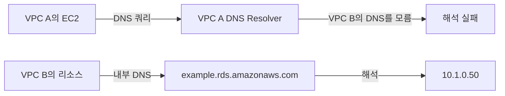
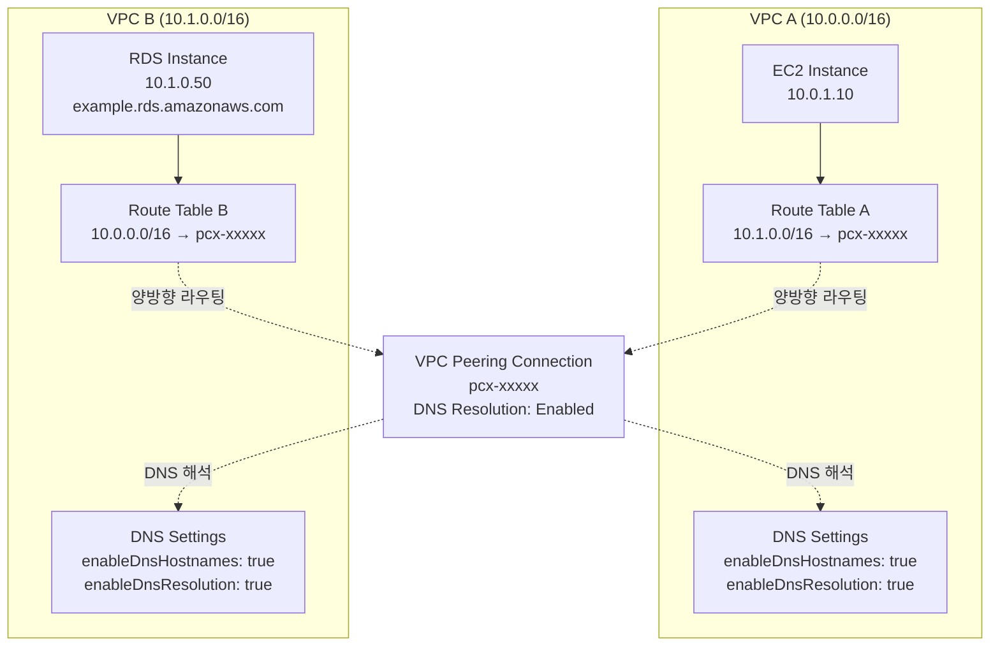

## 배경

VPC A에 애플리케이션 서버가 있고, VPC B에 RDS가 있는 구성이었다. VPC A의 서버에서 VPC B의 RDS(`example.rds.amazonaws.com`)에 접속해야 했다.

VPC 피어링 연결을 만들었다. 콘솔에서 상태도 Active로 잘 떴다. 끝난 줄 알았는데, 실제로 통신이 안 됐다. 여기서부터 2시간 넘는 삽질이 시작됐다.

원인은 크게 두 가지였다.

---

## 문제 1: 한쪽만 라우팅을 설정했다

피어링 연결을 만들고 VPC A의 라우팅 테이블에 VPC B로 가는 경로를 추가했다. 여기까지 하고 ping을 쳤는데 타임아웃이 떨어졌다.

```bash
$ ping 10.1.0.100
Request timeout for icmp_seq 0
Request timeout for icmp_seq 1
```

패킷이 VPC B까지는 도달하는데, 응답이 돌아오지 못하는 상황이었다. 한참 헤매다가 깨달은 게, VPC B에서 VPC A로 돌아오는 경로를 안 만들었다는 것이다.

당연한 이야기인데, TCP든 ICMP든 응답 패킷이 돌아와야 한다. 돌아오는 길이 없으니 타임아웃이 나는 거였다.

잘못된 구성:
```
VPC A (10.0.0.0/16)           VPC B (10.1.0.0/16)
Route Table:                  Route Table:
10.1.0.0/16 → pcx-xxxxx      (VPC A로 향하는 경로 없음)
```

올바른 구성:
```
VPC A (10.0.0.0/16)           VPC B (10.1.0.0/16)
Route Table:                  Route Table:
10.1.0.0/16 → pcx-xxxxx      10.0.0.0/16 → pcx-xxxxx
```

### 해결

양쪽 VPC의 라우팅 테이블 모두에 경로를 추가해야 한다.

VPC A 라우팅 테이블:

```bash
aws ec2 create-route \
  --route-table-id rtb-aaaaa \
  --destination-cidr-block 10.1.0.0/16 \
  --vpc-peering-connection-id pcx-xxxxx
```

VPC B 라우팅 테이블 (이걸 빼먹었다):

```bash
aws ec2 create-route \
  --route-table-id rtb-bbbbb \
  --destination-cidr-block 10.0.0.0/16 \
  --vpc-peering-connection-id pcx-xxxxx
```

콘솔에서 하려면 VPC → Route Tables → 라우팅 테이블 선택 → Routes 탭 → Edit routes에서 추가하면 된다. 양쪽 VPC 모두 해줘야 한다.

### 확인

```bash
$ ping 10.1.0.100
PING 10.1.0.100: 56 data bytes
64 bytes from 10.1.0.100: icmp_seq=0 ttl=254 time=0.891 ms
64 bytes from 10.1.0.100: icmp_seq=1 ttl=254 time=0.875 ms
```

ping이 드디어 통과됐다. 그런데 아직 끝이 아니었다.

---

## 문제 2: RDS 도메인으로 접속이 안 된다

라우팅을 양쪽 다 설정했으니 이제 되겠지 싶었는데, RDS 엔드포인트로 연결하면 또 실패했다.

```bash
$ mysql -h example.rds.amazonaws.com -u admin -p
ERROR 2005 (HY000): Unknown MySQL server host 'example.rds.amazonaws.com' (-2)
```

DNS 조회 자체가 실패하고 있었다.

```bash
$ nslookup example.rds.amazonaws.com
** server can't find example.rds.amazonaws.com: NXDOMAIN
```

그런데 IP 주소로 직접 접속하면 잘 된다.

```bash
$ mysql -h 10.1.0.50 -u admin -p
Welcome to the MySQL monitor.
```

IP는 되는데 도메인만 안 된다. 이 시점에서 DNS 문제라는 건 알겠는데, 왜 DNS가 안 되는지를 몰랐다.

### 원인: VPC 피어링은 DNS 해석을 자동으로 안 해준다

한참 찾아보고 나서야 알게 됐는데, RDS 엔드포인트(`example.rds.amazonaws.com`)는 VPC B 내부에서만 유효한 Private DNS 이름이다. VPC A의 DNS Resolver는 VPC B의 Private DNS를 해석할 수가 없다.



VPC 피어링을 만들었다고 DNS까지 자동으로 연동되는 게 아니었다. 명시적으로 활성화해야 하는 설정이 두 가지 있었다.

하나는 양쪽 VPC의 DNS 설정이고, 다른 하나는 피어링 연결 자체의 DNS 해석 옵션이다.

### 해결 1: 양쪽 VPC에서 DNS 설정 활성화

VPC A와 VPC B 모두에서 `enableDnsHostnames`와 `enableDnsSupport`를 켜야 한다.

콘솔에서는 VPC → Your VPCs → VPC 선택 → Actions에서 Edit DNS hostnames, Edit DNS resolution 각각 활성화하면 된다.

CLI로 하면:

```bash
# VPC A
aws ec2 modify-vpc-attribute \
  --vpc-id vpc-aaaaa \
  --enable-dns-hostnames

aws ec2 modify-vpc-attribute \
  --vpc-id vpc-aaaaa \
  --enable-dns-support

# VPC B
aws ec2 modify-vpc-attribute \
  --vpc-id vpc-bbbbb \
  --enable-dns-hostnames

aws ec2 modify-vpc-attribute \
  --vpc-id vpc-bbbbb \
  --enable-dns-support
```

### 해결 2: 피어링 연결에서 DNS 해석 옵션 활성화

여기서 또 하나 알게 된 건데, 이 옵션은 피어링 연결을 만들 때는 설정할 수가 없다. 피어링이 Active 상태가 된 후에만 수정할 수 있다. 처음에 이걸 모르고 피어링 생성 화면에서 DNS 옵션을 찾아 헤맸다.

콘솔에서는 VPC → Peering Connections → 피어링 선택 → Actions → Edit DNS Settings에서 Requester/Accepter 양쪽 DNS resolution을 모두 활성화한다.

CLI로 하면:

```bash
# Requester VPC에서 Accepter VPC의 DNS 해석 활성화
aws ec2 modify-vpc-peering-connection-options \
  --vpc-peering-connection-id pcx-xxxxx \
  --requester-peering-connection-options AllowDnsResolutionFromRemoteVpc=true

# Accepter VPC에서 Requester VPC의 DNS 해석 활성화
aws ec2 modify-vpc-peering-connection-options \
  --vpc-peering-connection-id pcx-xxxxx \
  --accepter-peering-connection-options AllowDnsResolutionFromRemoteVpc=true
```

설정이 제대로 됐는지 확인하려면:

```bash
# VPC 설정 확인
aws ec2 describe-vpc-attribute \
  --vpc-id vpc-aaaaa \
  --attribute enableDnsHostnames

aws ec2 describe-vpc-attribute \
  --vpc-id vpc-aaaaa \
  --attribute enableDnsSupport

# 피어링 연결 DNS 설정 확인
aws ec2 describe-vpc-peering-connections \
  --vpc-peering-connection-ids pcx-xxxxx
```

### 확인

```bash
$ nslookup example.rds.amazonaws.com
Server:         10.0.0.2
Address:        10.0.0.2#53

Non-authoritative answer:
Name:    example.rds.amazonaws.com
Address: 10.1.0.50  # VPC B의 Private IP로 정상 해석됨

$ mysql -h example.rds.amazonaws.com -u admin -p
Welcome to the MySQL monitor.
```

드디어 도메인으로도 접속이 됐다.

---

## 최종 구성

결국 이 모든 설정이 맞아야 VPC 피어링이 제대로 동작한다.

### 아키텍처



### 설정 요약

| 항목 | VPC A | VPC B | 비고 |
|------|-------|-------|------|
| 라우팅 테이블 | 10.1.0.0/16 → pcx-xxxxx | 10.0.0.0/16 → pcx-xxxxx | 양방향 필수 |
| enableDnsHostnames | Enabled | Enabled | 양쪽 VPC 모두 |
| enableDnsResolution | Enabled | Enabled | 양쪽 VPC 모두 |
| Peering DNS Resolution | Requester | Accepter | 피어링 연결 옵션 |
| Security Group | Outbound 허용 | Inbound 허용 | 필요한 포트만 |
| Network ACL | 양방향 허용 | 양방향 허용 | 상태 비저장 |

---

## 놓치기 쉬운 것들

### Security Group

라우팅이랑 DNS를 다 맞춰놨는데도 안 되면, Security Group을 확인해봐야 한다. 나도 처음에 이것 때문에 또 헤맸다.

VPC B의 RDS Security Group에 VPC A에서 오는 트래픽을 허용해줘야 한다.

```
Inbound:
Type: MySQL/Aurora
Protocol: TCP
Port: 3306
Source: 10.0.0.0/16 (VPC A의 CIDR) 또는 EC2의 Security Group ID
```

VPC A의 EC2 Security Group Outbound도 열려있는지 확인한다.

```
Outbound:
Type: MySQL/Aurora
Protocol: TCP
Port: 3306
Destination: 10.1.0.0/16 (VPC B의 CIDR) 또는 RDS Security Group ID
```

### Network ACL

Security Group은 상태 저장(Stateful)이라서 인바운드를 허용하면 응답은 자동으로 나간다. 그런데 Network ACL은 상태 비저장(Stateless)이라 양방향 규칙을 따로 만들어야 한다.

기본 Network ACL은 모든 트래픽을 허용하고 있어서 보통은 건드릴 일이 없지만, 커스텀 ACL을 사용하고 있다면 확인이 필요하다.

```
VPC A Network ACL:
Inbound  - Rule 100: ALL Traffic from 10.1.0.0/16 - ALLOW
Outbound - Rule 100: ALL Traffic to 10.1.0.0/16 - ALLOW

VPC B Network ACL:
Inbound  - Rule 100: ALL Traffic from 10.0.0.0/16 - ALLOW
Outbound - Rule 100: ALL Traffic to 10.0.0.0/16 - ALLOW
```

### CIDR 블록 중복

VPC 피어링에서 CIDR 블록이 겹치면 연결 자체가 안 만들어진다. 여러 VPC와 피어링하는 경우에 CIDR 설계를 처음부터 잘 해놔야 한다.

```
안 되는 경우:
VPC A: 10.0.0.0/16
VPC B: 10.0.0.0/16  (중복)

되는 경우:
VPC A: 10.0.0.0/16
VPC B: 10.1.0.0/16
```

### 세밀한 라우팅

전체 VPC CIDR을 라우팅하지 않고, 필요한 서브넷이나 IP만 열어둘 수도 있다.

```bash
# 특정 서브넷만
Destination: 10.1.0.0/24
Target: pcx-xxxxx

# RDS IP만
Destination: 10.1.0.50/32
Target: pcx-xxxxx
```

보안상 필요한 범위만 열어두는 게 맞긴 한데, 나중에 VPC B에 리소스가 추가되면 라우팅도 같이 수정해야 하니까 운영 편의성과의 트레이드오프가 있다.

---

## 연결이 안 될 때 확인 순서

삽질하면서 정리한 디버깅 순서다. 다음에 같은 문제가 생기면 이 순서대로 확인하려고 남겨둔다.

### 1. 라우팅 테이블

```bash
aws ec2 describe-route-tables \
  --filters "Name=vpc-id,Values=vpc-aaaaa" \
  --query "RouteTables[*].Routes"

aws ec2 describe-route-tables \
  --filters "Name=vpc-id,Values=vpc-bbbbb" \
  --query "RouteTables[*].Routes"
```

양쪽 VPC에 상대방 CIDR로의 경로가 있는지, Target이 올바른 피어링 연결 ID인지, Route 상태가 `active`인지(`blackhole`면 피어링이 끊긴 것) 확인한다.

### 2. DNS 설정

```bash
aws ec2 describe-vpcs \
  --vpc-ids vpc-aaaaa vpc-bbbbb \
  --query "Vpcs[*].[VpcId, EnableDnsHostnames, EnableDnsSupport]"

aws ec2 describe-vpc-peering-connections \
  --vpc-peering-connection-ids pcx-xxxxx \
  --query "VpcPeeringConnections[*].[RequesterVpcInfo.PeeringOptions, AccepterVpcInfo.PeeringOptions]"
```

양쪽 VPC의 `EnableDnsHostnames`, `EnableDnsSupport`가 `true`인지, 피어링의 `AllowDnsResolutionFromRemoteVpc`가 양방향 모두 `true`인지 확인한다.

### 3. Security Group

```bash
aws ec2 describe-security-groups \
  --group-ids sg-xxxxx \
  --query "SecurityGroups[*].IpPermissions"
```

RDS Security Group이 VPC A의 CIDR을 허용하는지, 포트(3306, 5432 등)가 열려 있는지 확인한다.

### 4. 피어링 연결 상태

```bash
aws ec2 describe-vpc-peering-connections \
  --vpc-peering-connection-ids pcx-xxxxx \
  --query "VpcPeeringConnections[*].Status"
```

상태가 `active`인지 확인한다. `pending-acceptance`로 남아있으면 Accepter 쪽에서 수락을 안 한 것이다.

### 5. 네트워크 연결 테스트

```bash
# ICMP
ping 10.1.0.50

# TCP
telnet 10.1.0.50 3306

# 또는 nc
nc -zv 10.1.0.50 3306
```

### 에러별 원인 정리

| 증상 | 원인 | 해결 |
|------|------|------|
| Connection timeout | 라우팅 테이블 미설정 또는 SG 차단 | 양방향 라우팅 확인, SG 규칙 확인 |
| DNS resolution failed | DNS 해석 비활성화 | VPC DNS 설정 + 피어링 DNS 옵션 활성화 |
| Route state: blackhole | 피어링이 pending 또는 삭제됨 | 피어링 상태 확인 |
| No route to host | Network ACL 차단 | ACL 양방향 규칙 확인 |

---

## 삽질을 마치며

2시간 넘게 삽질한 결과를 한 줄로 요약하면, VPC 피어링에서 "양방향"이라는 단어를 항상 머릿속에 두고 있어야 한다는 것이다. 라우팅 테이블도 양쪽, DNS 설정도 양쪽, Security Group도 양쪽. 한쪽만 설정하고 넘어가면 반드시 어딘가에서 막힌다.

특히 Private DNS 해석이 자동으로 안 된다는 점은 처음 겪으면 원인 파악이 어렵다. IP로는 접속이 되는데 도메인으로만 안 되면 DNS 해석 옵션부터 확인해보면 된다. 그리고 이 옵션은 피어링이 `active` 상태가 된 후에만 수정 가능하다는 것도 알아두면 좋다.

다음에 VPC 피어링을 구성할 때는 이 순서대로 진행하면 삽질을 줄일 수 있을 것 같다.

1. 양쪽 VPC DNS 설정 활성화 (enableDnsHostnames, enableDnsResolution)
2. 피어링 연결 생성 및 수락 (active 상태 대기)
3. 양방향 라우팅 테이블 설정
4. 피어링 DNS 해석 활성화
5. Security Group / Network ACL 확인
6. 연결 테스트 (ping, telnet, 실제 애플리케이션)
