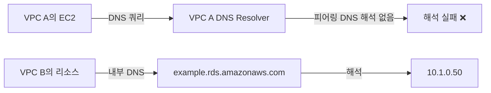
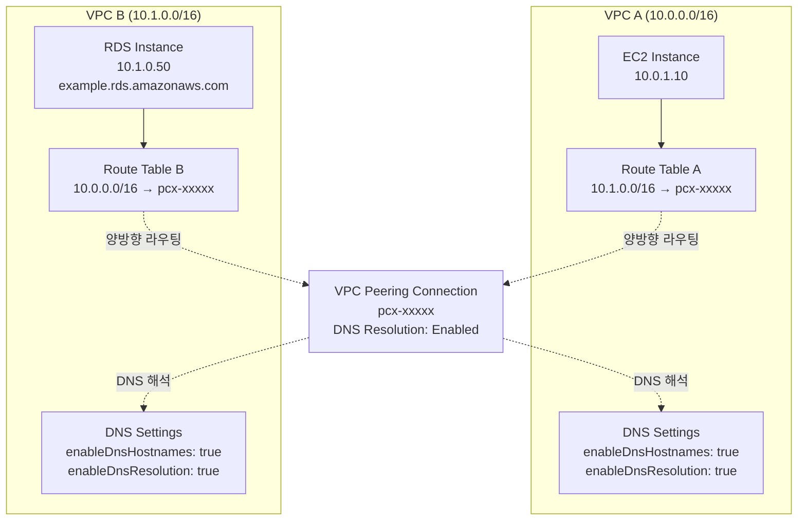

## 배경

AWS에서 멀티 VPC 환경을 구성하다 보면 VPC 피어링(VPC Peering)을 통해 서로 다른 VPC 간 통신이 필요한 경우가 생깁니다. 특히 한 VPC에서 다른 VPC의 RDS 인스턴스에 접근해야 하는 상황은 흔히 발생합니다.

이 글은 VPC 피어링을 구성하는 과정에서 마주친 두 가지 주요 문제와 해결 과정을 기록한 **삽질일기**입니다.

### 문제 상황 요약

- **VPC A**: 애플리케이션 서버가 실행되는 VPC
- **VPC B**: RDS 데이터베이스가 있는 VPC (Private Subnet)
- **목표**: VPC A의 서버에서 VPC B의 RDS(`example.rds.amazonaws.com`)에 접속

VPC 피어링 연결은 성공적으로 생성되었지만, 실제 통신은 되지 않았습니다. 이 문제를 해결하는 데 **2시간 이상**이 소요되었고, 크게 두 가지 원인이 있었습니다.

---

## 문제 1: 양방향 라우팅 테이블 설정 누락

### 발생한 문제

VPC 피어링 연결을 생성한 후, VPC A의 라우팅 테이블에만 VPC B로 향하는 경로를 추가했습니다. 하지만 **VPC B에서 VPC A로 돌아오는 경로를 추가하지 않아** 통신이 실패했습니다.

### 증상

```bash
# VPC A의 EC2에서 VPC B의 리소스로 ping
$ ping 10.1.0.100
# 타임아웃 발생
Request timeout for icmp_seq 0
Request timeout for icmp_seq 1
```

네트워크 패킷이 VPC B까지는 도달하지만, 응답 패킷이 VPC A로 돌아오지 못하는 상황이었습니다.

### 원인 분석

AWS VPC 피어링에서는 **양방향 라우팅 설정이 필수**입니다.

TCP와 ICMP의 경우 반드시 양방향 경로가 필요하며, UDP는 경로 대칭 없이도 작동할 수 있지만 들어오는 UDP 메시지가 ICMP 응답을 트리거할 수 있어 대칭 경로가 올바른 구성입니다.

**잘못된 구성:**
```
VPC A (10.0.0.0/16)           VPC B (10.1.0.0/16)
Route Table:                  Route Table:
10.1.0.0/16 → pcx-xxxxx      (VPC A로 향하는 경로 없음) ❌
```

**올바른 구성:**
```
VPC A (10.0.0.0/16)           VPC B (10.1.0.0/16)
Route Table:                  Route Table:
10.1.0.0/16 → pcx-xxxxx      10.0.0.0/16 → pcx-xxxxx ✅
```

### 해결 방법

#### 1. VPC A의 라우팅 테이블 설정

```bash
# AWS Console 또는 CLI로 설정
# Destination: VPC B의 CIDR (10.1.0.0/16)
# Target: VPC Peering Connection ID (pcx-xxxxx)
```

**AWS Console:**
1. VPC → Route Tables → VPC A의 라우팅 테이블 선택
2. Routes 탭 → Edit routes
3. Add route:
   - Destination: `10.1.0.0/16`
   - Target: Peering Connection (`pcx-xxxxx`)

**AWS CLI:**
```bash
aws ec2 create-route \
  --route-table-id rtb-aaaaa \
  --destination-cidr-block 10.1.0.0/16 \
  --vpc-peering-connection-id pcx-xxxxx
```

#### 2. VPC B의 라우팅 테이블 설정 (필수!)

```bash
# Destination: VPC A의 CIDR (10.0.0.0/16)
# Target: VPC Peering Connection ID (pcx-xxxxx)
```

**AWS Console:**
1. VPC → Route Tables → VPC B의 라우팅 테이블 선택
2. Routes 탭 → Edit routes
3. Add route:
   - Destination: `10.0.0.0/16`
   - Target: Peering Connection (`pcx-xxxxx`)

**AWS CLI:**
```bash
aws ec2 create-route \
  --route-table-id rtb-bbbbb \
  --destination-cidr-block 10.0.0.0/16 \
  --vpc-peering-connection-id pcx-xxxxx
```

### 검증

```bash
# VPC A의 EC2에서 VPC B의 리소스로 ping
$ ping 10.1.0.100
PING 10.1.0.100: 56 data bytes
64 bytes from 10.1.0.100: icmp_seq=0 ttl=254 time=0.891 ms
64 bytes from 10.1.0.100: icmp_seq=1 ttl=254 time=0.875 ms
```

### 삽질 포인트

> **한쪽 VPC에서만 라우팅을 설정하면 패킷이 도달은 하지만 응답이 돌아오지 않습니다.** 네트워크 트래픽은 항상 양방향이므로, 양쪽 VPC의 라우팅 테이블을 모두 설정해야 합니다.

---

## 문제 2: Private DNS 해석 비활성화

### 발생한 문제

라우팅 테이블을 양방향으로 올바르게 설정했음에도 불구하고, VPC A에서 VPC B의 RDS 엔드포인트(`example.rds.amazonaws.com`)로 연결할 수 없었습니다.

### 증상

```bash
# VPC A의 EC2에서 RDS 도메인으로 연결 시도
$ mysql -h example.rds.amazonaws.com -u admin -p
ERROR 2005 (HY000): Unknown MySQL server host 'example.rds.amazonaws.com' (-2)

# DNS 조회 실패
$ nslookup example.rds.amazonaws.com
Server:         10.0.0.2
Address:        10.0.0.2#53

** server can't find example.rds.amazonaws.com: NXDOMAIN
```

IP 주소로는 접속이 가능하지만, 도메인 이름으로는 접속할 수 없었습니다.

```bash
# IP로 직접 연결 시도 (성공)
$ mysql -h 10.1.0.50 -u admin -p
Welcome to the MySQL monitor.
```

### 원인 분석

RDS는 Private Subnet에 위치하므로 **Private IP만 할당**되어 있습니다. RDS의 엔드포인트(`example.rds.amazonaws.com`)는 AWS의 내부 DNS를 통해 Private IP로 해석되는데, 이는 **VPC 내부에서만 유효한 Private DNS**입니다.

#### Private DNS가 작동하는 원리



기본적으로 VPC 피어링 연결은 **DNS 쿼리 해석을 지원하지 않습니다**. 즉, VPC A는 VPC B의 Private DNS 이름을 해석할 수 없습니다.

#### 필수 요구사항

Private DNS 해석을 활성화하려면:

1. **양쪽 VPC에서 DNS 관련 설정 활성화**
   - `enableDnsHostnames`: VPC 리소스에 퍼블릭 DNS 호스트 이름 할당
   - `enableDnsResolution`: VPC 내 DNS 해석 활성화

2. **VPC 피어링 연결에서 DNS 해석 옵션 활성화**
   - Requester VPC DNS resolution
   - Accepter VPC DNS resolution

### 해결 방법

#### 1. VPC DNS 설정 확인 및 활성화

**VPC A와 VPC B 모두**에서 다음 설정을 활성화해야 합니다:

**AWS Console:**
```
VPC → Your VPCs → VPC 선택 → Actions → Edit DNS hostnames
- Enable DNS hostnames: ✅ 활성화

VPC → Your VPCs → VPC 선택 → Actions → Edit DNS resolution
- Enable DNS resolution: ✅ 활성화
```

**AWS CLI:**
```bash
# VPC A에서 DNS 설정 활성화
aws ec2 modify-vpc-attribute \
  --vpc-id vpc-aaaaa \
  --enable-dns-hostnames

aws ec2 modify-vpc-attribute \
  --vpc-id vpc-aaaaa \
  --enable-dns-support

# VPC B에서 DNS 설정 활성화
aws ec2 modify-vpc-attribute \
  --vpc-id vpc-bbbbb \
  --enable-dns-hostnames

aws ec2 modify-vpc-attribute \
  --vpc-id vpc-bbbbb \
  --enable-dns-support
```

#### 2. VPC 피어링 연결에서 DNS 해석 활성화

**중요:** DNS 해석 옵션은 피어링 연결 생성 시에는 활성화할 수 없습니다. 피어링 연결이 **Active 상태일 때만** 수정할 수 있습니다.

**AWS Console:**
```
VPC → Peering Connections → 피어링 연결 선택 → Actions → Edit DNS Settings

Requester VPC DNS resolution:
- ✅ Allow accepter VPC (VPC B) to resolve DNS of requester VPC (VPC A)

Accepter VPC DNS resolution:
- ✅ Allow requester VPC (VPC A) to resolve DNS of accepter VPC (VPC B)
```

**AWS CLI:**
```bash
# Requester VPC에서 Accepter VPC의 DNS 해석 활성화
aws ec2 modify-vpc-peering-connection-options \
  --vpc-peering-connection-id pcx-xxxxx \
  --requester-peering-connection-options AllowDnsResolutionFromRemoteVpc=true

# Accepter VPC에서 Requester VPC의 DNS 해석 활성화
aws ec2 modify-vpc-peering-connection-options \
  --vpc-peering-connection-id pcx-xxxxx \
  --accepter-peering-connection-options AllowDnsResolutionFromRemoteVpc=true
```

#### 3. DNS 설정 확인

```bash
# VPC 설정 확인
aws ec2 describe-vpc-attribute \
  --vpc-id vpc-aaaaa \
  --attribute enableDnsHostnames

aws ec2 describe-vpc-attribute \
  --vpc-id vpc-aaaaa \
  --attribute enableDnsSupport

# 피어링 연결 DNS 설정 확인
aws ec2 describe-vpc-peering-connections \
  --vpc-peering-connection-ids pcx-xxxxx
```

### 검증

```bash
# VPC A의 EC2에서 RDS 도메인 조회
$ nslookup example.rds.amazonaws.com
Server:         10.0.0.2
Address:        10.0.0.2#53

Non-authoritative answer:
Name:    example.rds.amazonaws.com
Address: 10.1.0.50  # VPC B의 Private IP로 정상 해석 ✅

# RDS 연결 테스트
$ mysql -h example.rds.amazonaws.com -u admin -p
Welcome to the MySQL monitor.
```

### 삽질 포인트

> **Private Subnet의 RDS는 Private DNS 이름만 사용합니다.** VPC 피어링만으로는 DNS 해석이 자동으로 되지 않으므로, 반드시 DNS 해석 옵션을 활성화해야 도메인 이름으로 접근할 수 있습니다.

---

## 완성된 VPC 피어링 아키텍처

### 최종 구성도



### 설정 체크리스트

| 항목 | VPC A | VPC B | 설명 |
|------|-------|-------|------|
| **라우팅 테이블** | 10.1.0.0/16 → pcx-xxxxx | 10.0.0.0/16 → pcx-xxxxx | 양방향 필수 |
| **enableDnsHostnames** | ✅ Enabled | ✅ Enabled | 양쪽 VPC 모두 |
| **enableDnsResolution** | ✅ Enabled | ✅ Enabled | 양쪽 VPC 모두 |
| **Peering DNS Resolution** | ✅ Requester | ✅ Accepter | 피어링 연결 옵션 |
| **Security Group** | Outbound 허용 | Inbound 허용 | 필요한 포트만 |
| **Network ACL** | 양방향 허용 | 양방향 허용 | 상태 비저장 |

---

## 추가 고려사항

### 1. Security Group 설정

라우팅과 DNS 해석만으로는 통신이 완전하지 않습니다. **Security Group**도 올바르게 설정해야 합니다.

**VPC B의 RDS Security Group (Inbound):**
```
Type: MySQL/Aurora
Protocol: TCP
Port: 3306
Source: VPC A의 CIDR (10.0.0.0/16) 또는 특정 EC2 Security Group
```

**VPC A의 EC2 Security Group (Outbound):**
```
Type: MySQL/Aurora
Protocol: TCP
Port: 3306
Destination: VPC B의 CIDR (10.1.0.0/16) 또는 RDS Security Group
```

### 2. Network ACL

Security Group이 상태 저장(Stateful)인 반면, Network ACL은 **상태 비저장(Stateless)**이므로 양방향 규칙이 필요합니다.

**VPC A의 Network ACL:**
```
Inbound Rules:
- Rule 100: ALL Traffic from 10.1.0.0/16 - ALLOW

Outbound Rules:
- Rule 100: ALL Traffic to 10.1.0.0/16 - ALLOW
```

**VPC B의 Network ACL:**
```
Inbound Rules:
- Rule 100: ALL Traffic from 10.0.0.0/16 - ALLOW

Outbound Rules:
- Rule 100: ALL Traffic to 10.0.0.0/16 - ALLOW
```

### 3. CIDR 블록 중복 방지

VPC 피어링에서 **CIDR 블록이 겹치면 연결 자체가 불가능**합니다.

```
❌ 불가능한 경우:
VPC A: 10.0.0.0/16
VPC B: 10.0.0.0/16  (중복!)

✅ 가능한 경우:
VPC A: 10.0.0.0/16
VPC B: 10.1.0.0/16  (비중복)
```

여러 VPC와 피어링하는 경우, CIDR 블록 관리를 철저히 해야 합니다.

### 4. 세밀한 라우팅 (선택 사항)

전체 VPC CIDR 대신 특정 서브넷이나 리소스로만 트래픽을 제한할 수 있습니다.

```bash
# 전체 VPC CIDR 대신
Destination: 10.1.0.0/24  # 특정 서브넷만
Target: pcx-xxxxx

# 또는 개별 IP
Destination: 10.1.0.50/32  # RDS IP만
Target: pcx-xxxxx
```

이 방식은 보안을 강화하고, 불필요한 트래픽을 줄일 수 있습니다.

---

## 트러블슈팅 가이드

### 연결이 안 될 때 체크리스트

#### 1. 라우팅 테이블 확인

```bash
# VPC A의 라우팅 테이블
aws ec2 describe-route-tables \
  --filters "Name=vpc-id,Values=vpc-aaaaa" \
  --query "RouteTables[*].Routes"

# VPC B의 라우팅 테이블
aws ec2 describe-route-tables \
  --filters "Name=vpc-id,Values=vpc-bbbbb" \
  --query "RouteTables[*].Routes"
```

**확인 사항:**
- [ ] VPC A → VPC B로 향하는 경로가 있는가?
- [ ] VPC B → VPC A로 향하는 경로가 있는가?
- [ ] Target이 올바른 피어링 연결 ID인가?
- [ ] Route 상태가 `active`인가? (`blackhole`가 아닌지 확인)

#### 2. DNS 설정 확인

```bash
# VPC DNS 설정 확인
aws ec2 describe-vpcs \
  --vpc-ids vpc-aaaaa vpc-bbbbb \
  --query "Vpcs[*].[VpcId, EnableDnsHostnames, EnableDnsSupport]"

# 피어링 DNS 설정 확인
aws ec2 describe-vpc-peering-connections \
  --vpc-peering-connection-ids pcx-xxxxx \
  --query "VpcPeeringConnections[*].[RequesterVpcInfo.PeeringOptions, AccepterVpcInfo.PeeringOptions]"
```

**확인 사항:**
- [ ] 양쪽 VPC의 `EnableDnsHostnames`가 `true`인가?
- [ ] 양쪽 VPC의 `EnableDnsSupport`가 `true`인가?
- [ ] 피어링의 `AllowDnsResolutionFromRemoteVpc`가 양방향 모두 `true`인가?

#### 3. Security Group 확인

```bash
# RDS Security Group 확인
aws ec2 describe-security-groups \
  --group-ids sg-xxxxx \
  --query "SecurityGroups[*].IpPermissions"
```

**확인 사항:**
- [ ] RDS Security Group이 VPC A의 CIDR 또는 EC2 SG를 허용하는가?
- [ ] 필요한 포트(3306, 5432 등)가 열려 있는가?

#### 4. 피어링 연결 상태 확인

```bash
aws ec2 describe-vpc-peering-connections \
  --vpc-peering-connection-ids pcx-xxxxx \
  --query "VpcPeeringConnections[*].Status"
```

**확인 사항:**
- [ ] 피어링 상태가 `active`인가?
- [ ] `pending-acceptance` 상태로 남아있지 않은가?

#### 5. 네트워크 연결 테스트

```bash
# ICMP 테스트 (Security Group에서 허용된 경우)
ping 10.1.0.50

# TCP 연결 테스트
telnet 10.1.0.50 3306

# 또는 nc (netcat) 사용
nc -zv 10.1.0.50 3306
```

### 일반적인 에러와 해결

| 증상 | 원인 | 해결 |
|------|------|------|
| Connection timeout | 라우팅 테이블 미설정 또는 Security Group 차단 | 양방향 라우팅 확인, SG Inbound/Outbound 규칙 확인 |
| DNS resolution failed | DNS 해석 비활성화 | VPC DNS 설정 활성화, 피어링 DNS 옵션 활성화 |
| Route state: blackhole | 피어링이 pending 또는 삭제됨 | 피어링 상태를 `active`로 변경 |
| No route to host | Network ACL 차단 | Network ACL의 양방향 규칙 확인 |

---

## 결론 및 핵심 교훈

VPC 피어링 구성은 단순해 보이지만, 실제로는 여러 계층의 설정이 조화를 이뤄야 합니다.

### 핵심 교훈

1. **🎯 양방향 라우팅은 필수**
   - VPC 피어링에서 한쪽만 라우팅을 설정하면 패킷이 돌아오지 못합니다
   - 양쪽 VPC의 라우팅 테이블을 모두 설정해야 정상 통신이 가능합니다

2. **🎯 Private DNS는 자동으로 해석되지 않습니다**
   - RDS 같은 Private 리소스는 Private DNS 이름으로 제공됩니다
   - VPC 피어링만으로는 DNS 해석이 안 되며, 명시적으로 활성화해야 합니다
   - 양쪽 VPC에서 `enableDnsHostnames`와 `enableDnsResolution` 모두 활성화 필요

3. **🎯 피어링 연결 옵션은 Active 상태에서만 수정 가능**
   - DNS 해석 옵션은 피어링 생성 시점에는 설정할 수 없습니다
   - 피어링이 `active` 상태가 된 후 수정해야 합니다

4. **🎯 Security Group과 Network ACL도 확인**
   - 라우팅과 DNS가 올바르더라도 보안 규칙이 막고 있을 수 있습니다
   - Security Group은 상태 저장, Network ACL은 상태 비저장이므로 설정 방식이 다릅니다

### 권장 설정 순서

VPC 피어링을 처음 구성할 때는 다음 순서를 따르세요:

1. **VPC DNS 설정 활성화** (양쪽 VPC)
   - enableDnsHostnames
   - enableDnsResolution

2. **VPC 피어링 연결 생성 및 수락**
   - Requester VPC에서 요청
   - Accepter VPC에서 수락
   - 상태가 `active`가 될 때까지 대기

3. **라우팅 테이블 설정** (양방향)
   - VPC A → VPC B
   - VPC B → VPC A

4. **피어링 DNS 해석 활성화**
   - Requester DNS resolution
   - Accepter DNS resolution

5. **Security Group 규칙 추가**
   - Inbound/Outbound 양방향

6. **Network ACL 확인** (필요시)
   - 기본값이 모두 허용이면 건너뛰기 가능

7. **연결 테스트**
   - ping, telnet, 실제 애플리케이션 테스트

### 마무리

VPC 피어링은 AWS 네트워킹의 기본이지만, 제대로 이해하지 않으면 불필요한 삽질을 하게 됩니다. 이 글이 같은 문제로 고생하는 분들에게 도움이 되길 바랍니다.

**시간을 아끼는 팁:** AWS Console에서 설정할 때는 반드시 **양쪽 VPC에서 모든 설정을 확인**하세요. 한쪽만 설정하고 넘어가면 반드시 문제가 발생합니다!
